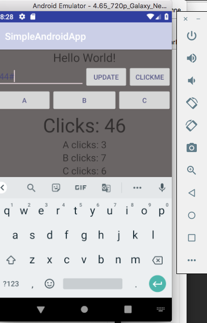
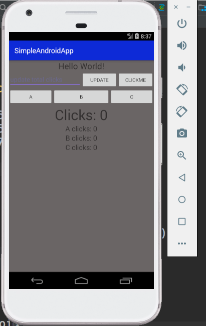

#Button App

##Overview
This application is a proof of life project to learn basic layout and design of Android applications in Android Studio.

##Screenshots

**External View**

**Internal Editor View**

